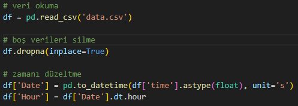
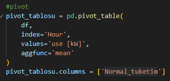
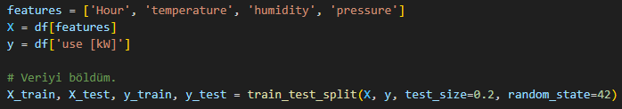
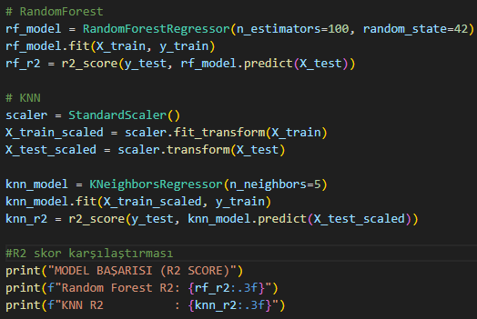
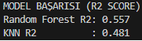
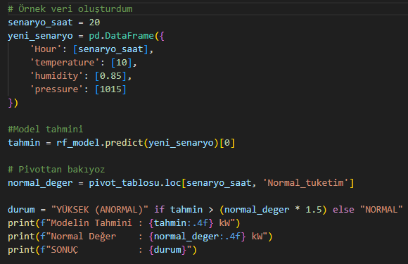
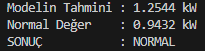
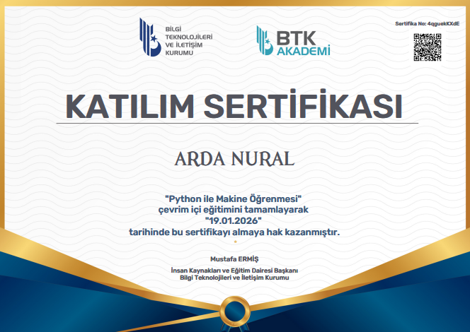

# Akıllı Evlerin Enerji Tüketim Tahmin Projesi

Projem akıllı evin pivot table oluşturduğum verileri analiz edip saat, sıcaklık, nem ve basınç gibi değişkenlerle ne kadar elektrik harcayacağını tahmin eder. Evin normal tüketim aralığını öğrenerek, yüksek elektrik tüketim durumlarında uyarı verir.

# Kodumun Çalışma Mantığı

data.csv dosyasını okuttum. Dosyanın içinde boş satırlar varsa modelim hata vermesin diye dropna ile o boşlukları temizledim.
Veri setimde zamanı modelimin anlayabileceği şekilde sayıya dönüştürüp sonrasında tarihe çevirdim. İnsanların sabah ve akşam tükettiği elektrik miktarının değişeceğini düşündüğüm için bana tarih değil de saat lazımdı o yüzden tarihin içinden saat bilgisini alıp yeni bir sütun yaptım.

# Pivot table kullanımı

Veri setimin boyutu büyük olduğu için ve anlık veri değil de ortalama veri istediğim için saatlik olarak akıllı evlerin ortalama elektrik tüketimini aldım. Bu şekilde akıllı evin saate göre normal elektrik tüketim miktarını pivot table kullanarak buldum. Modelimin tahmin yaparken bu tablodaki değerlere bakarak normal ya da yüksek elektrik tüketimi yaptığını tahmin etmesini istedim.

index='Hour' Veriyi neye göre ayıracağımızı söylediğim satır saatlik tüketimi merak ettiğimiz için 'Hour' yaptım.

values='use [kW]' Sonucunda ortalama elektrik tüketiğimini istediğim için 'use [kW]' yaptım.

aggfunc='mean' Normal davranışı bulmak istediğim için verilerin ortalamasını almasını istedim. O yüzden 'mean' kullandım. Hesapladığım ortalama tüketim miktarının data setimdeki use [kW] ile karışmaması için normal_tuketim diye sütun ismini değiştirdim.

Modelimin kopya çekmesin diye girdi kısmına saat, sıcaklık, nem , basınçı verdim. Tüketim bilgisini de gizledim. Modelime veriyi %80 eğitim %20 test şeklinde ayırdım.

Veri setimde hava durumu, saat, basınç gibi birbiriyle karmaşık ilişki olduğu için random forest modelini seçtim. KNN modelini de yeni gelen bir veriyi geçmişteki en benzer verileri bulup onun ortalamasını aldığı için akıllı ev sistemlerinde mantıklı sonuçlar verceğini düşündüm. KNN modelini kullanırken basınç ve nem arasındaki değer olarak çok fark olduğundan basınçın etkisini çok abartıyordu o yüzden standartscaler kullanıp sayı aralığını eşitledim. R2 skorlarına bakarak hangisinin daha iyi sonuç verdiğine karar verdim.

Random Forest KNN modeline göre daha başarılı oldu

Modelimi denemek için senaryo oluşturdum. Modele kendi öğrendikleriyle senaryoya göre elektrik tüketimi değerini tahmin ettirdim. Oluşturduğumuz pivot tabledan saatin normaline bakıp eğer bu değer normalin 1.5 kat üstündeyse tüketim yüksek uyarısı verdirttim. Eğer 1.5 katın altındaysa normal sonucunu verdi.

Çıktı Örneği

# Sonuç

Yaptığım testler sonucunda RandomForest modelinin KNN modeline göre daha verimli olduğunu gördüm. Hem anlık olarak tüketim tahmini yapabilen ve aynı zamanda saat aralığında ortalama tüketim değerleriyle karşılaştırıp normal veya anormal tüketim olarak uyarabilen model geliştirdim.

# Sertifika

